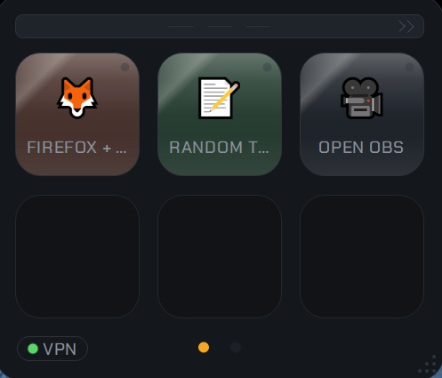
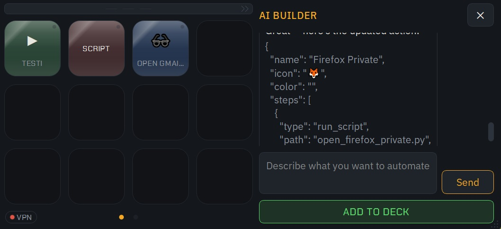
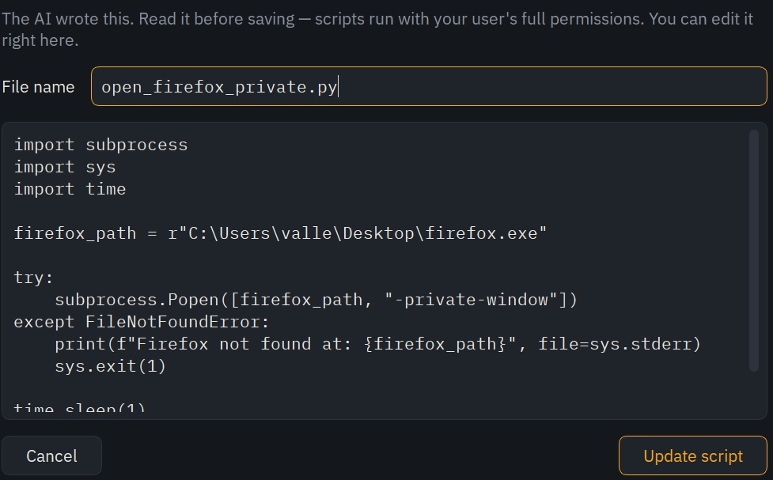
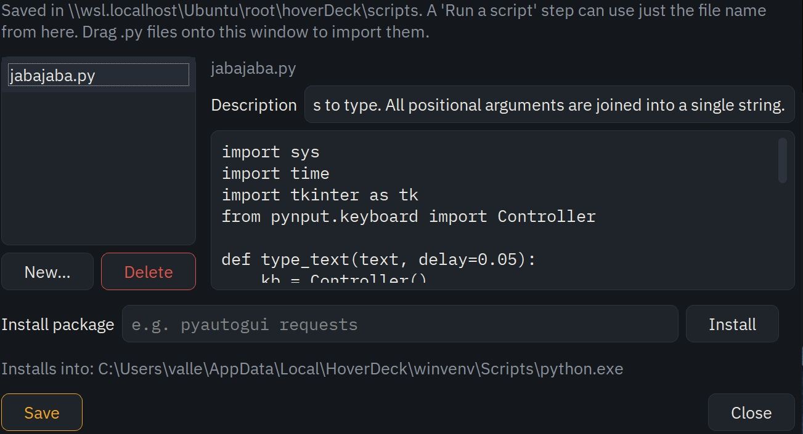
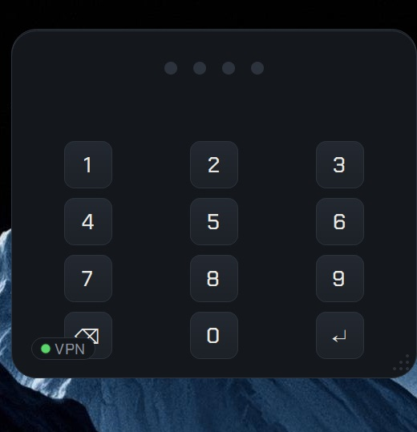
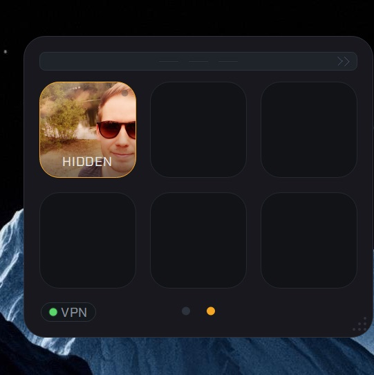

# HoverDeck

A frameless, always-on-top desktop overlay: a Stream Deck-style grid of
rounded-square keycaps. Each key fires an **Action** — an ordered chain of steps
(run a script, send keys, wait, branch on conditions). A PIN-locked hidden deck
keeps private keys invisible and encrypted until unlocked.

Design direction: An industrial electrical control panel.
Gunmetal housing, raised backlit keycaps, engraved label plates, and one
signature element: a tiny indicator LED on every key that shows run state
(amber pulse = running, green blink = done, red = fault). See `PLAN.md` §4.

## Screenshots

<p align="center">
  <br>
  <em>HoverDeck in action.</em>
</p>

<p align="center">
  <br>
  <em>The deck — frameless, always-on-top, docked to the screen edge.</em>
</p>

### Build automations with the AI

| Chat & suggestions | Review the script it writes |
|---|---|
|  |  |

Describe what you want; the AI asks questions (with tappable answers), writes small
reusable scripts you review before saving, and drops a finished key on a free slot.
The AI Builder uses **your own API key** (Anthropic or OpenAI) — add it in
**Settings → AI Builder** (the **Get a key…** button opens the right page). It's stored
locally in your settings and sent only to the provider you choose.

### Edit scripts & keys

| Script editor | |
|---|---|
|  | View, edit and describe the Python scripts your keys run — descriptions feed back to the AI. |

### Hidden vault

| Secret PIN pad | Private deck |
|---|---|
|  |  |

A long-press summons a PIN pad (no UI hint); the vault holds a separate, encrypted deck
and vault-only scripts that stay invisible until unlocked.

## Status

**Phases 1–3 are done.** Keys fire full step chains on worker threads with
LED feedback: scripts, key combos, waits, recorded macros, shell commands,
app/URL launches, and if/then/else branches on window title, pixel color,
file existence, or time of day.

- **Edit mode** (tray or right-click): pencil badges, drag-to-rearrange,
  button/action editors, macro recorder & player.
- **Multi-page decks**: click the page dots or swipe the grid; add/delete/
  rename pages in edit mode.
- **Adjustable size**: drag the 3-dot grip in the bottom-right corner, or use
  the Size slider in Settings (60–200%, live preview).
- **Peek mode**: the chevron on the drag handle (or tray → "Pin to edge")
  tucks the deck to the nearest screen edge behind an amber half-circle lamp;
  click it to slide the deck back.
- **AI Builder**: a chat panel (Anthropic or OpenAI — set a key in Settings)
  that asks questions, builds an action, and adds it to the deck.
- **Hidden vault**: long-press the drag handle (~1.5s); the first PIN you
  enter becomes the code. The vault page and its keys live in an encrypted
  blob (PBKDF2 + Fernet) — never in deck.json — and auto-relock on hide,
  tuck, or timeout.
- **VPN status overlay** (optional): a clean connected/disconnected indicator on
  the deck and the peek lamp — green when a VPN tunnel is actually carrying your
  traffic, red when it isn't. Toggle it in Settings → General; fully hidden when off.
- **Global hotkeys** (Windows): bind combos to keys in Settings → Hotkeys.
  **Autostart** toggle in Settings → General (Windows only).

Remaining (Phase 4, see `PLAN.md` §6): PyInstaller packaging, active-window
profiles, final polish.

## Install (Windows)

Windows 10/11, 64-bit.

1. Open the latest release on the **[Releases](../../releases)** page.
2. Under **Assets**, download **`HoverDeck-Setup-x.y.z.exe`** (the installer).
3. Run it. It's a **per-user install** — no admin needed — into
   `%LOCALAPPDATA%\Programs\HoverDeck`, with a Start-menu shortcut (and an optional
   desktop shortcut) and an uninstaller.
4. The build isn't code-signed yet, so Windows SmartScreen may warn *"Windows protected
   your PC."* Click **More info → Run anyway**.
5. Launch **HoverDeck** from the Start menu. It lives in the system tray and docks to the
   right edge of your screen — drag the strip at the top to move it, right-click for the
   menu, or **Quit HoverDeck** from the tray/right-click.

**Prefer no install?** Download the portable **`HoverDeck.exe`** from the same Assets and
just run it. **Uninstall:** Settings → Apps, or the Start-menu *Uninstall HoverDeck*.

Your decks, macros, settings and the encrypted vault are stored in
`%APPDATA%\HoverDeck` and are left untouched by uninstalling.

### First-run setup (optional)

- **AI Builder** needs *your own* API key. Open **Settings → AI Builder**, click
  **Get a key…** to open Anthropic's or OpenAI's page, create a key, and paste it. It's
  stored locally and sent only to the provider you pick. Everything else works without it.
- **Run-a-script** steps (and AI-written scripts) need **Python** installed — get it from
  [python.org](https://python.org) (tick *Add to PATH*) and, if needed, point HoverDeck at
  it in **Settings → Script interpreter**. Opening apps/URLs, sending keys, shell commands
  and macros all work without Python.
- **Autostart:** turn on *Start with Windows* in **Settings → General**.

## Run it (from source)

```bash
python3 -m venv .venv
.venv\Scripts\activate          # Windows
source .venv/bin/activate       # macOS/Linux
pip install -r requirements.txt
python3 main.py
```

First run creates `./data/` (dev) or `%APPDATA%/HoverDeck` (packaged) with an
empty deck — enter edit mode (tray or right-click → "Edit the deck") and click
"+ Add a key" to build your own.

- **Drag** the machined strip at the top to move the deck.
- **Arrow keys** move focus, **Enter** fires the focused key.
- **Tray icon**: show/hide the deck, quit.
- Deck JSON is hand-editable: `data/decks/deck.json`.

Optional: drop the fonts listed in `assets/fonts/FONTS.md` into `assets/fonts/`
for the full engraved-label look (the app falls back to system fonts otherwise).

## Run on Windows (recommended)

HoverDeck is a Windows app: frameless always-on-top windows, the system tray,
global hotkeys, and active-window profiles all behave correctly there. Under
WSL/WSLg the Linux compositor overrides window placement and hiding, so run it
natively on Windows — you can still edit the code from WSL.

You need **Python 3.11+** installed on Windows ([python.org](https://python.org),
tick *Add to PATH*). Then, from the repo (it's reachable from Windows Explorer
at `\\wsl.localhost\<distro>\...` if it lives in WSL):

- **`run-windows.bat`** — double-click to run. First launch creates a Windows
  venv under `%LOCALAPPDATA%\HoverDeck` (kept out of the repo so it never
  clashes with the Linux `.venv`), installs `requirements-windows.txt`, and
  starts the app. It runs the **live source**, so after editing in WSL you only
  re-run the bat — no rebuild. Quit from the deck: right-click → **Quit HoverDeck**.
- **`build-windows.bat`** — builds a standalone **`dist\HoverDeck.exe`** (one
  file, windowed, icon + fonts bundled) via `build.py` / PyInstaller. If
  PyInstaller trips on the `\\wsl.localhost\…` path, copy the repo to a local
  Windows folder and build there.

Data on Windows lives in `%APPDATA%\HoverDeck`, not the dev `./data` — copy
`data\decks`, `data\macros`, `data\vault`, and `data\settings.json` across to
carry over an existing setup.

## Tests

```bash
pip install pytest
pytest
```

`core/`, `storage/`, and `security/` are pure Python (zero Qt imports) and
unit-testable.

## Layout

See `PLAN.md` §3 for the full tree. The short version:

```
hoverdeck/core/      pure logic: models, steps, action runner
hoverdeck/storage/   JSON persistence
hoverdeck/security/  vault crypto (Phase 4)
hoverdeck/ui/        all Qt: theme tokens, keycaps, overlay, tray
scripts/             your own Python scripts (gitignored)
data/                runtime data in dev (gitignored)
```

## License

Private project. Bundled fonts are under the SIL Open Font License 1.1
(see `assets/fonts/FONTS.md`).
